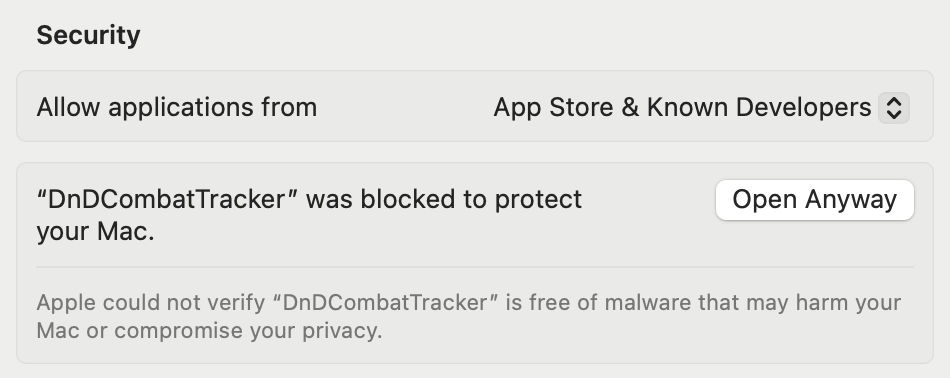
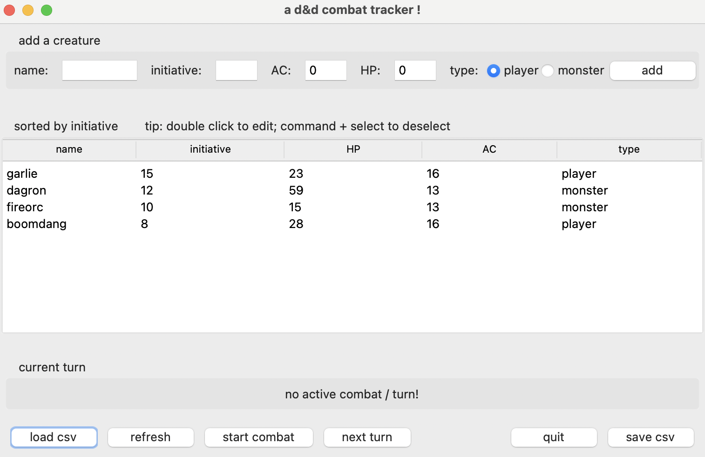
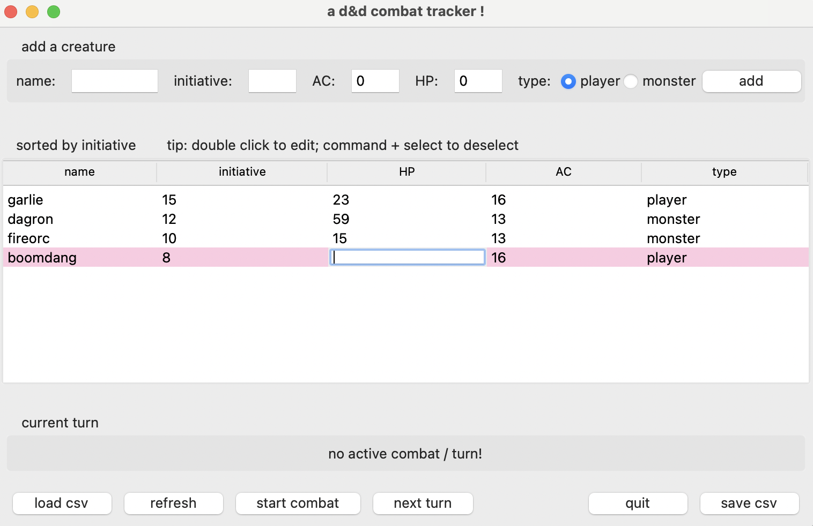
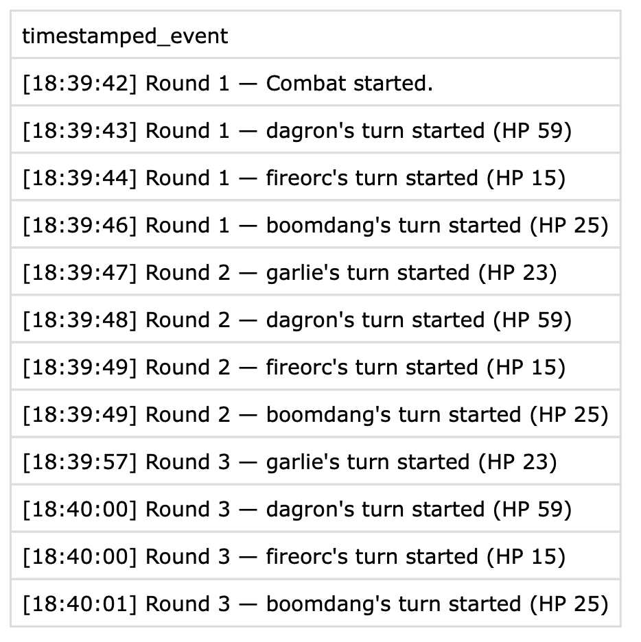

# Installation
you can either download from the release zip (mac only) or install directly from source:

## via release
yay first release: 
https://github.com/kailinzhuang/dnd-combat-tracker/releases/

download the `.zip` file and double click to open  
note: you might see a security warning from mac OS and would need to go to `Settings` > `Privacy & Security` to allow open:




## directly from src
``` bash
git clone git@github.com:kailinzhuang/dnd-combat-tracker.git
```

``` bash
cd dnd-combat-tracker/src
```

``` bash
python -m dnd_combat_tracker.gui   
```

# Usage
## Load from a csv file
Make sure to follow the same format as the example [`example_import.csv`](assets/example_import.csv) fields.



## Edit HP/AC
Double click a field (HP/AC) to edit.



## Export initiative csv


## Save combat log
Prompted to save when quitting (if there's a log).



# Acknowledgements
THANK YOU to kate henn & james dix for many helpful suggestions and feedback !!! <3
